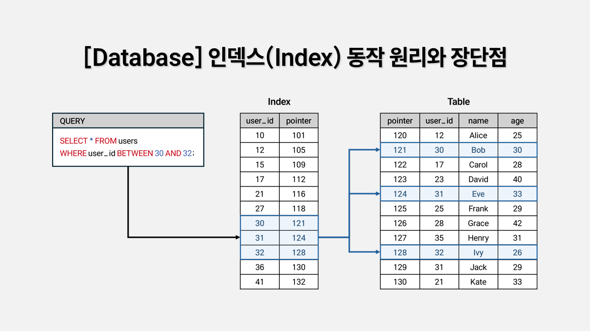
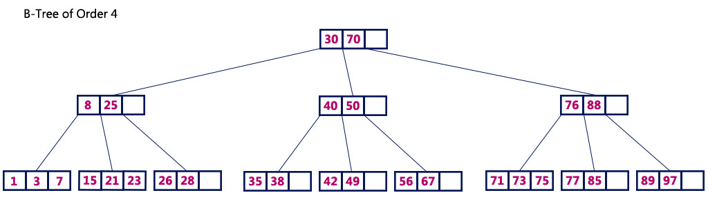
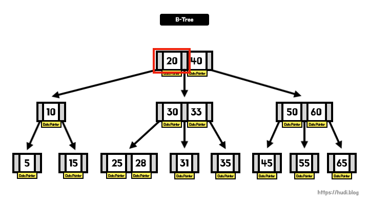
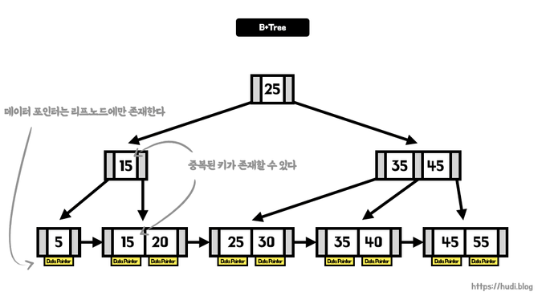
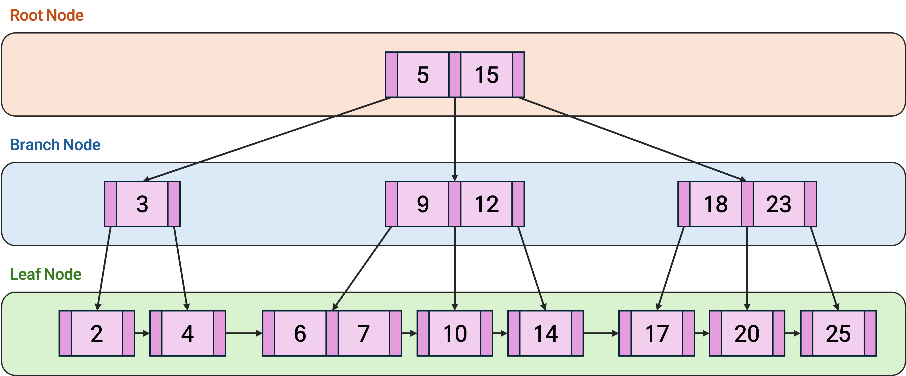

# 9주차 데이터베이스

## 인덱스 원리(B-Tree 등) · SQL 최적화 · 실행 계획 분석

## 오늘 다룰 키워드

- 인덱스: **B-Tree / B+Tree**, 페이지(I/O), fan-out, range scan
- 설계: **선택도/카디널리티**, 복합 인덱스, 좌측 접두 규칙, 커버링
- SQL 튜닝: **SARGable**, JOIN, 정렬/집계 비용
- 실행 계획: **EXPLAIN**, rows 추정/실제, join 방식, sort/hash

---

## 발표 흐름(목차)

1. 인덱스가 필요한 이유(“느려지는 지점”)
2. **B-Tree/B+Tree 원리**: 페이지 기반 구조 & 탐색/삽입
3. **인덱스 설계 실전**: 어떤 컬럼/순서/개수?
4. **SQL 최적화**: 자주 터지는 패턴과 리라이트
5. **실행 계획 분석**: EXPLAIN 읽는 법 + 샘플 해석
6. 예시

---

# 1) 인덱스가 필요한 이유

인덱스는 데이터베이스 테이블의 조회 속도를 향상시키기 위한 자료구조



## DB 성능 병목의 “진짜 주범”: 디스크 I/O

- CPU 연산은 빠름
- 디스크/SSD에서 페이지 읽기(랜덤 I/O)는 상대적으로 비쌈
- 테이블이 커질수록 “전체를 읽는 비용”이 폭증

**인덱스의 본질**

- “조건에 맞는 row 위치”를 **적은 페이지 접근으로 찾는 구조**

---

## 인덱스가 없으면: Full Scan(전체 스캔)

예: 주문 테이블 1억 건에서 특정 유저 주문 20개만 보고 싶다?

```sql
SELECT *
FROM orders
WHERE user_id = 123
ORDER BY created_at DESC
LIMIT 20;
```

- 인덱스 없음 → `orders` 전체를 훑고 조건 필터링
- 그리고 정렬까지 하면? → **Sort 비용도 추가**

---

## 인덱스는 공짜가 아니다(트레이드오프)

인덱스가 늘면…

- ✅ SELECT 성능 ↑ (특정 조건에 강함)
- ❌ INSERT/UPDATE/DELETE 성능 ↓ (인덱스도 함께 갱신)
    - CREATE, DELETE, UPDATE가 빈번한 속성에 인덱스를 걸게 되면 인덱스의 크기가 비대해져서 성능이 오히려 저하된다
- ❌ 저장공간 ↑
    - 인덱스를 관리하기 위해 데이터베이스의 약 10%의 추가 저장공간이 필요
- ❌ 옵티마이저가 잘못된 통계로 “틀린 플랜” 선택할 위험 ↑

**결론**

- “자주 실행되는 쿼리”를 기준으로 필요한 것만 만든다.

---

## 인덱스를 사용하면 좋은 경우

- 규모가 작지 않은 테이블
- INSERT, UPDATE, DELETE가 자주 발생하지 않는 컬럼
- JOIN이나 WHERE 또는 ORDER BY에 자주 사용되는 컬럼
- 이터의 중복도가 낮은 컬럼

## 인덱스의 장점

- 특정 열에 인덱스를 생성하면, 인덱스를 위한 메모리 공간에, 데이터(key)와 물리적 주소(value)가 함께 저장됨
- 조건 검색 WHERE 절의 효율성
    - 인덱스를 사용하지 않으면 조건 검색(WHERE) 시에 전체 테이블을 탐색해야 함
- 정렬 ORDER BY 절의 효율성
    - 인덱스를 사용하면 ORDER BY에 의한 SORT 과정을 생략할 수 있음
- MAX, MIN의 효율적 처리

## 퀴즈: 인덱스가 있어도 Full Scan을 할 수 있다?

정답: **그렇다.**

이유(대표):

- 조건이 너무 넓어서(선택도 낮음) 인덱스 타도 결국 대부분 row를 읽어야 함
- 인덱스 경로가 랜덤 I/O를 유발해 오히려 비싸짐
- 통계가 부정확해서 옵티마이저 판단이 틀림

---

# 2) B-Tree / B+Tree 인덱스 원리

인덱스를 구현하기위한 대표적인 자료구조

## 왜 B-Tree 계열이 표준처럼 쓰이나?

DB는 보통 데이터를 **페이지(page)** 단위로 읽는다.

- 목표: “한 번의 페이지 읽기”로 가능한 많은 키를 확인
- B-Tree: **노드 하나에 키를 많이 담아 fan-out↑ → 트리 높이↓**

탐색 복잡도: 대략 **O(log N)**

- N이 커져도 깊이가 크게 늘지 않음(페이지 I/O 횟수 절감)
- 메모리에 담기 어려운 큰 크기의 데이터를 다루기 위해 사용된다. 즉, 파일 시스템 혹은 데이터베이스에 적합

---

## B-Tree 개념 구조(멀티 키 노드)

(개념 그림)




- 노드 하나에 여러 키
- 한 노드 당 자식 노드가 2개 이상 가능
- 키가 “경계값” 역할을 하며 자식으로 분기

---

## B+Tree(실전에서 더 흔함)



많은 DB 인덱스는 B+Tree 형태가 흔함(구현은 DB마다 다름).
실제로 MySQL(InnoDB) 등 많은 DBMS에서는 B-Tree대신 B+Tree를 사용

- **내부 노드**: 키 + 자식 포인터(길 안내)
- **리프 노드**: 정렬된 키 + (row pointer 또는 PK)
- 리프 노드는 **연결 리스트**로 이어짐 → 범위 스캔(range scan) 강함
- B+Tree는 리프 노드를 연결 리스트(linked list)로 연결. 즉, 정렬된 상태의 리프 노드를 순차 검색. 이로 인해 인덱싱에 더욱 적합한 자료구조

- 다만, B+Tree에서는 실제 데이터에 접근하기 위해서는 무조건 리프 노드까지 탐색해야한다. 따라서 운이 좋으면, 금방 데이터를 찾을수도 있는 B-Tree와 다르게, B+Tree는 고정적으로 O(logN)의 탐색 시간을 갖는다



`users` 테이블에 `user_id` 컬럼이 있고, 위 그림과 같은 B+Tree 인덱스가 걸려 있다고 가정합니다.

### 예시 1. 단일 값 검색

```sql
SELECT * FROM users WHERE user_id = 7;
```

동작 순서:

1. **Root Node [5, 15]** → 7은 5 이상 15 미만이므로 중간 **Branch Node [9, 12]** 로 이동
2. **Branch Node [9, 12]** → 7은 9 미만이므로 왼쪽 **Leaf Node [6, 7]** 로 이동
3. **Leaf Node [6, 7]** 에서 `user_id = 7`에 해당하는 실제 데이터의 위치(포인터)를 찾음

인덱스가 없었다면 테이블 전체를 순차 스캔해야 하지만, B+Tree에서는 **단 3번의 비교**로 원하는 행을 찾을 수 있습니다.

### 예시 2. 범위 검색

범위 검색에서는 리프 노드가 **연결 리스트**로 이어진 구조가 장점으로 작용합니다.

```sql
SELECT * FROM users WHERE user_id BETWEEN 6 AND 14;
```

동작 순서:

1. **Root → Branch [9, 12]** → 6이 속한 구간이므로 중간 노드로 이동
2. **시작점 탐색** → Branch에서 **Leaf [6, 7]** 로 내려가 시작값 6을 찾음
3. **연결 리스트 순회** → 리프를 따라 [6, 7] → [10] → [14]를 순차적으로 수집

범위의 **시작점만 찾은 뒤**에는 리프 노드의 연결 리스트를 따라가기만 하면 되므로, 범위 스캔이 효율적으로 이루어집니다.

---

## “페이지” 관점으로 이해하기

- 테이블/인덱스는 보통 **페이지 단위**로 저장/읽기
- 인덱스 노드(특히 internal)는 페이지 크기에 맞춰 많은 키를 담음
- fan-out이 커질수록 높이 감소

예시 감각:

- fan-out 200, row 1억이면 깊이가 대략 `log_200(1e8)` 수준 → 몇 단계 안 됨  
  → **몇 번의 페이지 읽기만으로** 목표 위치 도달 가능

---

## 인덱스 탐색 과정(= 조건을 “경로”로 바꾸기)

쿼리:

```sql
WHERE user_id = 123
```

- 루트 페이지 읽기
- 내부 노드 페이지 몇 번 읽기
- 리프에서 `123`이 있는 위치 찾기
- 리프에 저장된 포인터로 실제 row(또는 PK 기반) 접근

“전체 스캔”이 아니라 “트리 경로”로 접근한다.

---

## Range Scan(범위 스캔)이 강한 이유

쿼리:

```sql
WHERE created_at BETWEEN '2026-02-01' AND '2026-02-07'
```

- 시작 키까지는 Seek(탐색)
- 그 이후는 **리프 연결을 따라 순차적으로 읽기**
- 디스크는 **순차 읽기**가 랜덤 읽기보다 효율적인 경우가 많음

---

## 삽입 시 동작: 페이지 분할(Page Split)

B+Tree는 “균형”을 유지해야 함.

- 리프 페이지가 꽉 차면?
    - 새 페이지를 만들고 키를 **분할(split)**
    - 상위 노드에 “경계 키”를 올림
- 결과: 쓰기 작업이 많으면 split 비용이 누적될 수 있음

인덱스가 많을수록, 그리고 랜덤한 키 삽입일수록 쓰기 비용이 커짐

---

## 클러스터드/힙 구조 차이(개념)

DB마다 저장 방식이 다름.

- **클러스터드(예: InnoDB의 PK 기반)**: 테이블 데이터가 PK 순으로 저장되는 느낌
    - PK 범위 스캔이 강함
- **힙(예: PostgreSQL heap)**: 데이터가 물리적으로 흩어질 수 있음
    - 인덱스로 찾은 뒤 테이블 접근이 랜덤 I/O가 될 수 있음

---

## B-Tree 말고도 인덱스가 있다

- Hash 인덱스: `=` 검색은 빠를 수 있으나 범위 검색은 약함(엔진/제약 다름)
- Bitmap 인덱스: 값 종류가 적고 대량 분석에 유리한 경우(주로 DW)
- Full-text/GIN/GiST 등: 텍스트 검색/특수 데이터 타입

오늘의 메인은 **B-Tree/B+Tree** (OLTP에서 가장 흔한 기반)

---

# 3) 인덱스 설계 실전

## 설계의 출발점: “쿼리 패턴”부터

인덱스 설계 = 아래를 많이 보는 패턴

- WHERE 조건
- JOIN 키
- ORDER BY / GROUP BY
- LIMIT(Top-N)

**쿼리 TOP N을 먼저 뽑고, 그 쿼리를 빠르게 만드는 인덱스를 설계한다.**

---

## 선택도(Selectivity)와 카디널리티(Cardinality)

- 카디널리티: 서로 다른 값 개수
- 선택도: 조건이 얼마나 row를 “좁히는지”

예시:

- `gender` (남/여) → 카디널리티 낮음 → 선택도 낮음 → 인덱스 효율 낮을 수 있음
- `user_id` (수백만) → 카디널리티 높음 → 선택도 높음 → 인덱스 효율 높음

---

## 예시로 보는 선택도 판단

orders 1억 건:

- `status = 'PAID'`가 90%면  
  → 필터링 효과 거의 없음 → 인덱스 써도 결국 대부분 읽음
- `user_id = 123`이 평균 100건이면  
  → 1억 중 100만 읽으면 됨 → 인덱스 가치 큼

**옵티마이저는 이런 “분포”를 통계로 추정해서 플랜을 고른다.**

---

## 단일 인덱스 vs 복합 인덱스

단일:

```sql
CREATE INDEX idx_orders_user ON orders(user_id);
```

복합:

```sql
CREATE INDEX idx_orders_user_created ON orders(user_id, created_at DESC);
```

차이:

- 단일 인덱스는 `user_id` 조건에는 좋지만 `ORDER BY created_at`는 별도 정렬이 필요할 수 있음
- 복합 인덱스는 `user_id`로 좁힌 뒤 **정렬된 created_at**을 바로 활용 가능(Top-N 강함)

---

## 복합 인덱스 컬럼 순서 결정법(가장 자주 묻는 것)

기본 원칙(실전형):

1. WHERE에서 **강하게 좁히는 컬럼(선택도 높은 컬럼)**을 앞에
2. 그 다음 ORDER BY / GROUP BY에 쓰는 컬럼을 고려
3. 자주 같이 등장하는 조건 묶음을 우선

예:

```sql
WHERE user_id = ?
ORDER BY created_at DESC
LIMIT 20
```

추천:

- `(user_id, created_at DESC)`

---

## 좌측 접두(Leftmost Prefix) 규칙 (감각적으로)

인덱스: `(A, B, C)`

- A가 있어야 B/C 활용이 쉬움
- B만 단독이면 보통 어려움(엔진/통계에 따라 일부 활용될 수도 있으나 기대하면 위험)

예시:

- ✅ `WHERE A = 1 AND B = 2`
- ✅ `WHERE A = 1 AND B BETWEEN 10 AND 20`
- ⚠️ `WHERE B = 2` (A가 없으니 인덱스 “시작점”을 잡기 어려움)

---

## 예시: 같은 복합 인덱스라도 순서가 바뀌면?

쿼리:

```sql
SELECT *
FROM orders
WHERE user_id = 123 AND status = 'PAID'
ORDER BY created_at DESC
LIMIT 20;
```

후보 인덱스 1:

- `(user_id, status, created_at DESC)`

후보 인덱스 2:

- `(status, user_id, created_at DESC)`

데이터 분포에 따라:

- status가 거의 대부분이면(선택도 낮음) status를 앞에 두는 건 비효율일 수 있음
- user_id가 더 좁히면 user_id를 앞에 두는 편이 유리

---

## 커버링 인덱스(Covering) / Index-Only 개념

“테이블을 다시 읽지 않고” 인덱스만으로 결과를 만들 수 있으면 빠르다.

쿼리:

```sql
SELECT created_at, status
FROM orders
WHERE user_id = 123
ORDER BY created_at DESC
LIMIT 20;
```

인덱스:

- `(user_id, created_at DESC)` + (status 포함)

PostgreSQL 예시(Include):

```sql
CREATE INDEX idx_orders_user_created_inc
ON orders(user_id, created_at DESC)
INCLUDE (status);
```

---

## (주의) DB별 커버링/저장 방식 차이

- PostgreSQL: INCLUDE로 “인덱스에 추가 컬럼”을 저장 가능
- MySQL(InnoDB): 보조 인덱스에 PK가 포함되는 구조 → 커버링 개념은 동일하지만 구현이 다름

발표 포인트:

- “커버링 인덱스”는 공통 개념
- 문법/세부 구현은 DB별로 다를 수 있음

---

## 인덱스를 못 쓰게 만드는 대표 패턴 1: 컬럼에 함수 적용

❌ (인덱스 사용 어려운 형태)

```sql
SELECT *
FROM orders
WHERE DATE(created_at) = DATE '2026-02-01';
```

✅ (범위 조건으로 리라이트)

```sql
SELECT *
FROM orders
WHERE created_at >= TIMESTAMP '2026-02-01 00:00:00'
  AND created_at <  TIMESTAMP '2026-02-02 00:00:00';
```

이유:

- B+Tree는 “정렬된 값” 기준으로 범위를 잘 탄다.

---

## 인덱스를 못 쓰게 만드는 대표 패턴 2: 암시적 형변환

예) user_id가 BIGINT인데 문자열로 비교하면…

```sql
-- 위험(엔진에 따라 인덱스 무효/비효율 가능)
WHERE user_id = '123'
```

✅ 명확하게 타입 맞추기:

```sql
WHERE user_id = 123
```

---

## 인덱스를 못 쓰게 만드는 대표 패턴 3: LIKE 앞 와일드카드

```sql
WHERE name LIKE '%kim'
```

- B-Tree는 “앞에서부터 정렬”되어 있어서 `%kim`은 시작점을 잡기 어려움
- 대안:
    - 접두 검색: `LIKE 'kim%'`
    - 또는 full-text / trigram / reverse index 등(엔진별 기능)

---

## 인덱스 “개수” 최적화: 너무 많아도 망한다

- 읽기 쿼리 10개를 위해 인덱스 20개 만들면?
    - 쓰기 비용 + 유지비 + 통계 관리 비용 폭증
- 실전 기준:
    - “자주 실행되는 쿼리” / “매출·핵심 기능 쿼리” 우선
    - 중복되는 인덱스(접두 포함 관계) 정리

예:

- `(A, B)` 인덱스가 있으면 `(A)` 인덱스는 중복일 수 있음(엔진별 확인 필요)

---

# 4) SQL 최적화(튜닝) — 패턴으로 익히기

## SQL 튜닝 1순위: 결과 집합을 줄여라

- `SELECT *` 지양
- 필요한 컬럼만
- 불필요한 row를 일찍 제거(WHERE 조건 강화)
- LIMIT을 “인덱스로” 빠르게 만들기(Top-N 최적화)

---

## 패턴 A: OFFSET 기반 페이지네이션의 함정

❌

```sql
SELECT *
FROM orders
ORDER BY id DESC
LIMIT 20 OFFSET 100000;
```

- OFFSET이 커질수록 앞부분을 버리기 위해 많이 읽어야 함

✅ Keyset Pagination(커서 기반)

```sql
SELECT *
FROM orders
WHERE id < :last_id
ORDER BY id DESC
LIMIT 20;
```

- 인덱스 `(id)`로 바로 다음 페이지를 빠르게 탐색 가능

---

## 패턴 B: OR 조건이 인덱스를 망치는 경우

```sql
WHERE user_id = 123 OR status = 'PAID'
```

- OR은 플랜이 복잡해지고 Full Scan으로 갈 수 있음

대안:

- UNION ALL로 분리(중복 처리 필요 시 UNION)

```sql
SELECT * FROM orders WHERE user_id = 123
UNION ALL
SELECT * FROM orders WHERE status = 'PAID' AND user_id <> 123;
```

> 단, 중복/정합성 요구에 따라 설계가 달라짐

---

## 패턴 C: SARGable(인덱스 친화) 조건 만들기

✅ 좋은 형태:

- `col = ?`
- `col BETWEEN ? AND ?`
- `col >= ?`

❌ 나쁜 형태(인덱스 탐색 어려움):

- `FUNCTION(col) = ?`
- `col + 1 = ?`
- `CAST(col AS ...) = ?` (상황에 따라)

---

## 패턴 D: JOIN 최적화 — “인덱스 + row 수 줄이기”

예시:

- users(100만), orders(1억)

쿼리:

```sql
SELECT u.id, u.name, o.amount
FROM users u
JOIN orders o ON o.user_id = u.id
WHERE u.country = 'KR'
  AND o.created_at >= '2026-02-01';
```

핵심:

- `users(country)` 또는 `(country, id)` 인덱스 고려
- `orders(user_id, created_at)` 혹은 `orders(created_at, user_id)`는 쿼리 패턴에 따라 선택
- “먼저 KR 유저로 줄이고, 그 유저의 주문만 탐색”이 되면 좋음

---

## JOIN 알고리즘 3종(실행 계획에서 자주 보임)

1. Nested Loop Join

- 작은 쪽(row 적은 쪽)에서 큰 쪽으로 인덱스 탐색 반복
- 인덱스가 있으면 매우 강함
- 하지만 반복 횟수가 많으면 폭발

2. Hash Join

- 한 쪽을 해시 테이블로 만들고 매칭(대량 동등 조인에 강함)
- 메모리/스필(디스크) 영향

3. Merge Join

- 정렬된 두 입력을 병합
- 정렬 비용이 관건(이미 정렬돼 있으면 좋음)

---

## 패턴 E: DISTINCT/GROUP BY/ORDER BY = “정렬 비용”

정렬은 비쌈.

- 메모리 부족하면 디스크 temp 사용 → 더 비쌈

최적화 아이디어:

- ORDER BY 컬럼에 인덱스가 있으면 sort를 피할 수 있음
- GROUP BY 전 필터로 데이터량 줄이기
- DISTINCT가 필요한 이유(조인 중복)부터 해결하기

---

## EXISTS vs JOIN vs IN (실전 판단)

“존재 여부”만 필요하면 EXISTS가 직관적

```sql
SELECT u.*
FROM users u
WHERE EXISTS (
  SELECT 1
  FROM orders o
  WHERE o.user_id = u.id
    AND o.status = 'PAID'
);
```

- JOIN은 결과가 “증식”될 수 있어 DISTINCT가 추가되는 패턴이 흔함
- 하지만 DB 옵티마이저가 내부 변환을 하기도 함  
  → 최종 판단은 **실행 계획으로**

---

# 5) 실행 계획(EXPLAIN) 분석

## 실행 계획이란?

옵티마이저가 선택한 “실행 전략 요약”

- 어떤 Scan(Seq/Index)으로 읽는지
- 어떤 Join 방식인지
- 정렬/집계가 어디서 발생하는지
- 추정 rows vs 실제 rows

---

## DB별 EXPLAIN 대표(개념)

PostgreSQL:

- `EXPLAIN` : 계획만
- `EXPLAIN (ANALYZE, BUFFERS)` : 실제 실행 + 버퍼(읽기) 정보

MySQL:

- `EXPLAIN` (tabular)
- `EXPLAIN ANALYZE` (버전/엔진에 따라)

Oracle:

- `EXPLAIN PLAN`, `DBMS_XPLAN`

---

## 실행 계획을 읽는 기본 순서(실전 팁)

1. **가장 아래 노드부터 위로**(입력 → 결과)
2. “row가 갑자기 늘어나는 구간”을 찾기
3. “비싼 연산(Sort/Hash/Temp)”이 어디인지 찾기
4. “추정 vs 실제 rows 차이”가 큰지 보기(추정 실패는 플랜 실패로 이어짐)

---

## PostgreSQL 스타일 예시(샘플)

```text
Limit  (cost=0.42..12.50 rows=20 width=...)
  ->  Index Scan using idx_orders_user_created on orders
        (cost=0.42..5000.00 rows=8000 width=...)
        Index Cond: (user_id = 123)
```

해석:

- Limit(20) → Top-N
- Index Scan 사용 → user_id 조건을 인덱스로 탐색
- cost는 절대 시간이 아니라 “비용 추정치(상대값)”

---

## MySQL EXPLAIN에서 자주 보는 컬럼(샘플 관점)

- type: 접근 방식(ALL=풀스캔, ref/range 등)
- possible_keys / key: 후보/선택된 인덱스
- rows: 읽을 것으로 예상하는 row 수
- Extra: Using where, Using filesort(정렬), Using temporary 등

“Using filesort”가 뜨면?

- ORDER BY를 인덱스로 처리 못 하고 정렬을 따로 했을 가능성

---

## “추정(rows) vs 실제(rows)”가 중요한 이유

추정이 틀리면 이런 일이 생김:

- Nested Loop가 좋을 거라 생각했는데 실제로는 반복이 너무 많아서 폭발
- Hash Join 메모리 충분할 거라 봤는데 스필 발생

추정이 틀리는 대표 원인:

- 통계가 오래됨(ANALYZE 필요)
- 데이터 분포가 치우침(skew)
- 컬럼 간 상관관계가 큼(옵티마이저가 단순 독립 가정)

---

## 실행 계획에서 자주 보는 노드(공통)

Scan:

- Seq/Table Scan: 전체 읽기
- Index Scan: 인덱스 + 테이블 접근
- Index Only Scan: 인덱스만으로 처리(가능 조건 충족 시)

Join:

- Nested Loop
- Hash Join
- Merge Join

정렬/집계:

- Sort
- HashAggregate / GroupAggregate

---

## “인덱스 쓰는데도 느림” 대표 케이스 3가지

1. **너무 많은 row를 인덱스로 읽음**

- 인덱스 타고 가도 결과가 수백만이면 테이블 랜덤 접근이 폭발

2. **Key Lookup(테이블 재방문) 남발**

- 필요한 컬럼이 인덱스에 없어서 매 row마다 테이블 접근
- 해결: 커버링 인덱스(또는 include 컬럼) 고려

3. **정렬/임시 테이블이 병목**

- ORDER BY/GROUP BY 때문에 sort/temp가 발생
- 해결: 정렬을 인덱스로 흡수 / 결과 줄이기 / 쿼리 구조 변경

---

# 6) 예시

## 예시 1: Top-N 쿼리 최적화(ORDER BY + LIMIT)

쿼리:

```sql
SELECT id, created_at, amount
FROM orders
WHERE user_id = 123
ORDER BY created_at DESC
LIMIT 20;
```

인덱스 후보:

```sql
CREATE INDEX idx_orders_user_created ON orders(user_id, created_at DESC);
```

기대 효과:

- Sort 없이 인덱스 순서대로 바로 20개 뽑기(Top-N 최적화)

---

## 예시 2: 함수 때문에 인덱스 못 타는 쿼리 리라이트

느릴 가능성:

```sql
SELECT *
FROM orders
WHERE DATE(created_at) = DATE '2026-02-01';
```

개선:

```sql
SELECT *
FROM orders
WHERE created_at >= TIMESTAMP '2026-02-01 00:00:00'
  AND created_at <  TIMESTAMP '2026-02-02 00:00:00';
```

---

## 예시 3: 커버링 인덱스(테이블 재방문 줄이기)

쿼리:

```sql
SELECT created_at, status
FROM orders
WHERE user_id = 123
ORDER BY created_at DESC
LIMIT 20;
```

PostgreSQL 예시:

```sql
CREATE INDEX idx_orders_user_created_inc
ON orders(user_id, created_at DESC)
INCLUDE (status);
```

---

# 7) 마무리

## 핵심 요약

- B+Tree 인덱스는 **“정렬된 키 + 낮은 트리 높이”로 I/O를 줄이는 구조**
- 인덱스 설계는:
    - 쿼리 패턴(WHERE/JOIN/ORDER BY/LIMIT) + 선택도 + 컬럼 순서
- SQL 최적화는:
    - SARGable 조건 + 결과 집합 축소 + 정렬/집계 비용 최소화
- 실행 계획 분석은:
    - Scan/Join/Sort 위치 확인 + rows 추정 vs 실제 비교

---
