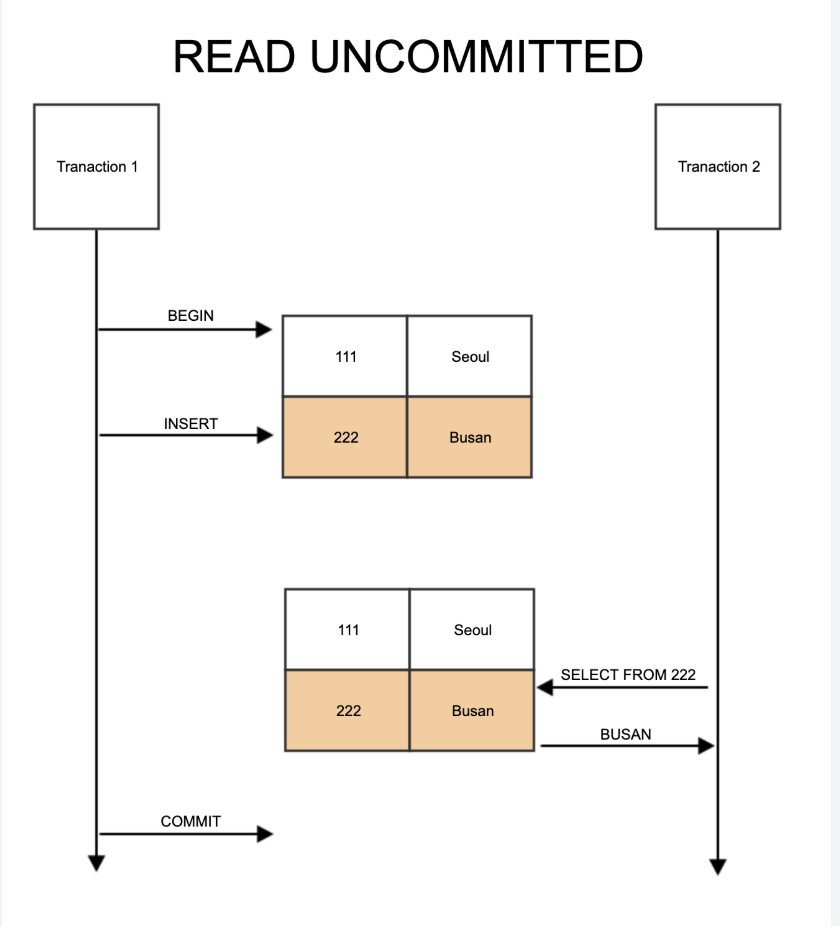
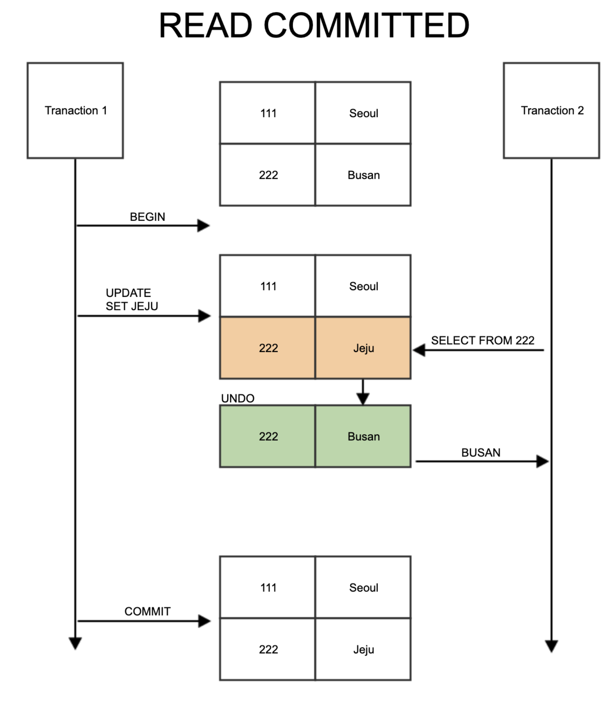
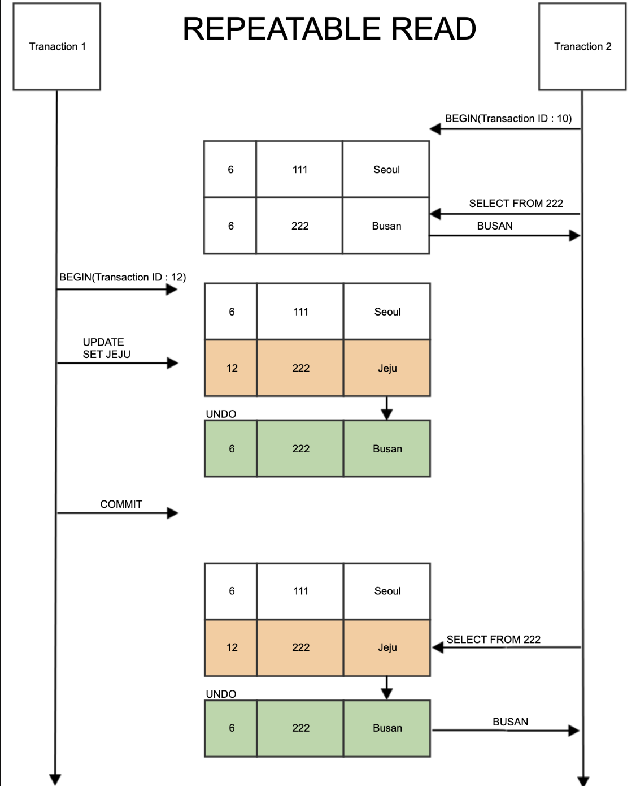

# 8주차 데이터베이스 - 관계형 데이터베이스, 정규화, 트랜잭션(ACID), 격리 수준

## 1️⃣ 데이터베이스(Database)란?

**데이터를 체계적으로 저장하고 관리하는 공간**
- 여러 사람, 여러 시스템이 데이터를 쉽게 공유할 수 있다
- 이런 DB를 관리하는 시스템을 DBMS (Database Magement System)이라고 한다 

## 2️⃣ 관계형 데이터베이스 (Relational Database)
- 가장 대표적인 dbms

### 핵심 개념
- 데이터를 **테이블(Table)** 형태로 저장
- 테이블은 **행(Row)** 과 **열(Column)** 로 구성
- 테이블 간의 관계(Relation)를 맺을 수 있음

### SQL
- 관계형 데이터베이스에서 데이터를 정의, 조작, 제어, 조회하기 위해 사용하는 표준  프로그래밍 언어

### 예시: 이커머스 사이트

**User 테이블**

| user_id | name | email |
|-------|------|-------|
| 1 | user1 | user1@example.com |
| 2 | user2 | user2@example.com |

**Order 테이블**

| order_id | user_id | product |
|--------|--------|--------|
| 101 | 1 | 노트북 |
| 102 | 1 | 마우스 |
| 103 | 2 | 키보드 |

➡ `user_id`로 **User ↔ Order 관계** 연결

### 대표적인 RDBMS
- MySQL
- PostgreSQL
- Oracle
- SQLite

---

## 3️⃣ 정규화 (Normalization)

### 정규화란?
> **데이터 중복을 줄이고, 이상 현상(Anomaly)을 방지하는 설계 방법**

### ❌ 정규화 안 된 경우

| 주문번호 | 고객이름 | 고객이메일 | 상품 | 가격|
|--------|---------|-----------|-----|-----|
| 1 | user1 | user1@example.com | 마우스, 키보드 |5000,10000|
| 2 | user2 | user2@example.com | 마우스 |5000|

### ⛔️ 이상 현상 (Anomaly)
#### 갱신 이상 ( Modification Anomaly):
중복된 데이터 중 일부를 갱신할 때 의도치 않은 데이터가 갱신됨으로써 생기는 데이터의 불일치
#### 삽입 이상 ( Insertion Anomaly )
새 데이터를 삽입할 때 의도치 않은 데이터가 삽입됨으로써 생기는 데이터의 불일치
#### 삭제 이상 ( Deletion Anomaly )
데이터를 삭제할 때 의도치 않은 데이터까지 삭제됨으로써 생기는 데이터의 불일치

---

### ✅ 정규화하기
#### 제1정규화 (1NF)
-> 한칸에 하나의 데이터만

-> SELECT 할때 성능이 좋아 진다

```
CREATE TABLE order_info_1nf (
  order_id INT,
  customer_name VARCHAR(50),
  customer_email VARCHAR(100),
  product VARCHAR(50),
  price INT
);
```

| order_id | customer_name | customer_email | product | price|
|--------|---------|-----------|-----|-----|
| 1 | user1 | user1@example.com | 마우스 | 5000|
| 1 | user1 | user1@example.com | 키보드 | 10000|
| 2 | user2 | user2@example.com | 마우스 | 5000|


#### 제2정규화 (2NF)
-> 완전 함수 종속(Full Functional Dependency)을 만족하도록 테이블을 분해
-> 어떤 컬럼 A가 있으면 컬럼 B가 항상 하나로 결정되는 상태

```
CREATE TABLE orders (
  order_id INT,
  customer_name VARCHAR(50),
  product VARCHAR(50)
);

CREATE TABLE customers (
  customer_name VARCHAR(50),
  customer_email VARCHAR(100),
);

CREATE TABLE products (
  product VARCHAR(50),
  price VARCHAR(100),
  PRIMARY KEY (product, price)
);
```
`orders`
| order_id | customer_name | product |
|--------|---------|-------|
| 1 | user1 | 마우스 |
| 1 | user1 | 키보드 |
| 2 | user2 | 마우스 |

`customers`
| customer_name | customer_email | 
|---------|-----------|
| user1 | user1@example.com |
| user2 | user2@example.com |

`products`
| product | price|
|-----|-----|
| 마우스 | 5000|
| 키보드 | 10000|

- UPDATE가 수월해짐

⚠️ 하나의 테이블로 알 수 있는 정보가 적어짐 
(예: 주문번호1의 가격을 계산할때 두개의 테이블을 확인해야 됨)

#### 제3정규화 (3NF)
| user_name | rank | pointback (%) |
|---------|-----------|---|
| user1 | DIAMOND | 15 |
| user2 | GOLD | 5 |
| user2 | PLATINUM | 10 |
- X->Y, Y->Z 일 때 X->Z 를 만족해버리면 이행 함수 종속이 발생

-> 위같은 이행 함수 종속(Transitive Functional Dependency)을 제거

```
CREATE TABLE ranks (
  rank VARCHAR(20) PRIMARY KEY,
  pointback INT
);

CREATE TABLE users (
  user_name VARCHAR(50),
  rank VARCHAR(20),
  PRIMARY KEY (user_name, rank),
  FOREIGN KEY (rank) REFERENCES ranks(rank)
);
```
`ranks`
| 등급 | 포인트백 |
|-----------|---|
| DIAMOND | 15% |
| GOLD | 5% |
| PLATINUM | 10% |

`users`
| 고객이름 | 등급 | 
|---------|-----------|
| user1 | DIAMOND |
| user2 | GOLD |
| user2 | PLATINUM |


---

## 4️⃣ 트랜잭션(Transaction)

### 트랜잭션이란?
> **데이터베이스의 상태를 변화시키기 위해 수행하는 작업의 논리적 단위**
데이터 베이스의 상태를 변화: SELECT, INSERT, UPDATE, DELETE 등과 같은 조작어를 사용하는 행동

커밋(Commit): 모든 부분작업이 정상적으로 완료하면 이 변경사항을 한꺼번에 DB에 반영한다.
롤백(Rollback): 부분 작업이 실패하면 트랜잭션 실행 전으로 되돌린다.

### 실생활 예시: 은행 이체

A가 B에게 10만 원 송금

트랜잭션에 포함되는 작업

1. A 계좌 잔액 −100,000
2. B 계좌 잔액 +100,000

👉 둘 다 성공하거나, 둘 다 실패해야 함

👉 두 작업을 하나의 **트랜잭션**으로 묶음

---

### SQL Transaction 예시
```
BEGIN;

UPDATE account
SET balance = balance - 100000
WHERE user_id = 'A';

UPDATE account
SET balance = balance + 100000
WHERE user_id = 'B';

COMMIT;
-- 중간에 에러 나면 ROLLBACK
```

## 5️⃣ ACID 속성

트랜잭션이 지켜야 할 4가지 성질

### 🔹 Atomicity (원자성)
- 전부 성공 or 전부 실패

> 예: 출금 성공, 입금 실패 ❌

---

### 🔹 Consistency (일관성)
- 트랜잭션 전후로 데이터 규칙 유지

> 예: 잔액이 음수가 되면 안 됨

---

### 🔹 Isolation (격리성)
- 동시에 실행되는 트랜잭션이 서로 간섭 ❌

> 예: 동시에 같은 좌석 예매

---

### 🔹 Durability (지속성)
- 완료된 트랜잭션은 **절대 사라지지 않음**

> 예: 결제 완료 후 서버 꺼져도 기록은 남아야 함

---

## 6️⃣ 트랜잭션 격리 수준 (Isolation Levels)

> **"얼마나 다른 트랜잭션을 신경 안 쓰고 실행할까?"**

격리 ↑ → 데이터 정확성 ↑, 성능 ↓

격리 ↓ → 성능 ↑, 동시성 문제 ↑

### 동시성 문제
#### 1. Dirty READ
어떤 트랜잭션에서 작업이 완료되지 않았는데 다른 트랜잭션에서 볼 수 있는 상황
```
T1: 잔액 = 100 → 0 (아직 COMMIT 안 함)
T2: 잔액 = 0 읽음
T1: ROLLBACK
➡ T2는 존재하지 않았던 값을 읽음
```

#### 2. Non-repeatable READ
같은 SELECT를 두 번 했는데 다른 트랜잭션에 의해 결과가 달라짐
```
T1: SELECT 잔액 = 100
T2: UPDATE 잔액 = 50 COMMIT
T1: SELECT 잔액 = 50
```
#### 3. Phantom READ
동일한 조건 검색 결과의 행 개수가 다른 트랜잭션에 의해 달라짐
```
T1: SELECT * FROM 주문 WHERE 금액 >= 100 (5건)
T2: INSERT 주문(금액=200) COMMIT
T1: 다시 SELECT → 6건
```
---
### 격리수준 4단계 (낮은순)
### 🔸 READ UNCOMMITTED
- 커밋 안 된 데이터도 읽음
- ⬇️ 가장 낮은 격리수준 



> 예: 결제 중인 금액을 다른 사람이 봄
> `Dirty READ` 발생 위험

---

### 🔸 READ COMMITTED
- 커밋된 데이터만 읽음
- 다른 트랜잭션은 UNDO log에 백업된 값을 가져오기 때문에 커밋되지 않은 데이터는 접근 불가



> 예: 결제 완료된 정보만 조회
> `Non-repeatable READ` 발생 위험
💡 PostgreSQL 기본값
---

### 🔸 REPEATABLE READ
- 같은 데이터는 항상 같은 값을 보장 
- Transaction Id를 통해 격리 수준 유지
- 각 트랙잭션은 자신의 트랜잭션 아이디보다 낮은 트랜잭션 번호에서 변경한 것 만 확인



> 결제 전 금액 검증
> `Phantom READ` 발생 가능하지만 MYSQL InnoDB에서는 조건에 해당 되는 모든 인덱스 행에 Lock걸어 방지 가능
💡 MySQL 기본값
---

### 🔸 SERIALIZABLE
- 한 트랜잭션에서 읽고 쓰는 레코드를 다른 트랜잭션에서 절대 접근 불가
- 모든 읽기/쓰기에 Lock
- 동시서 ↓ 성능 ↓ 안정성 ↑

> 모든 트랜잭션을 순서대로 처리

---

| 격리 수준            | Dirty | Non-repeatable | Phantom |
| ---------------- | ----- | -------------- | ------- |
| READ UNCOMMITTED | 🔴     | 🔴              | 🔴       |
| READ COMMITTED   | 🟢     | 🔴              | 🔴       |
| REPEATABLE READ  | 🟢     | 🟢             | 🟠      |
| SERIALIZABLE     | 🟢     | 🟢            | 🟢      |

| 상황      | 추천                    |
| ------- | --------------------- |
| 단순 조회   | READ COMMITTED        |
| 재고 / 쿠폰 | REPEATABLE READ + 락   |
| 결제 / 정산 | SERIALIZABLE or 명시적 락 |

## 7️⃣ 정리 한 장 요약

- 관계형 DB: **테이블 + 관계**
- 정규화: **중복 제거 + 데이터 안정성**
- 트랜잭션: **작업 묶음**
- ACID: **신뢰성 보장 규칙**
- 격리 수준: **동시성 vs 성능의 균형**

---


